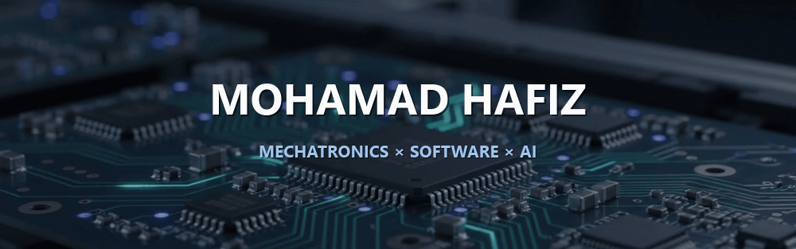
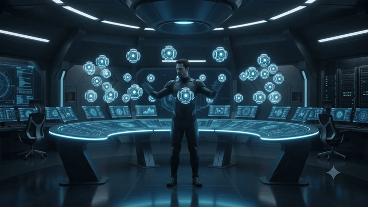
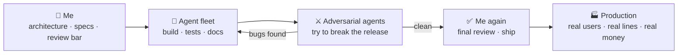

<!-- HERO — Higgsfield-generated loop with baked-in title (assets/banner.svg kept as fallback) -->

 

---

## 🤖 I build with an AI agent fleet

I'm an **AI-native engineer**: I treat agentic AI (Claude Code, ChatGPT) as my engineering team — I set
the architecture, the guardrails, and the review bar; the agents multiply the throughput. It's how one
final-year student ships like a small team, without shipping slop:

  

- 🏭 **5+ production full-stack systems** for enterprise & government clients in ~12 months
- 🚀 **A live SaaS** — [skipedit.app](https://skipedit.app) — solo-built *and* solo-operated: GPU workers, payments verified with real money in both directions (purchase **and** refund clawback)
- 🕵️ **Adversarial multi-agent bug-hunts on my own releases** — one 18-agent hunt caught 18 real bugs (2 critical) before launch; another (24 agents) caught 7 more
- 👁️ **An AOI machine-vision system** designed, deployed, and validated **on a live automotive production line**

The loop above is not aspirational — it's the documented workflow behind every project on this page.

---

## 🔧 Featured projects

| Project | What it is | Stack |
|---|---|---|
| **[ai-fastener-inspection](https://github.com/hafizradzi8901/ai-fastener-inspection)** | Edge **machine vision** for automotive fastener inspection — 0.995 mAP@0.5, **59 FPS at 15 W** on Jetson, validated on a live line. Full ablation + leakage-corrected results | Python, YOLO, TensorRT, Jetson |
| **SkipEdit** ([live](https://skipedit.app)) | A **SaaS platform** that turns lecture recordings + slides into synced presenter-and-slides videos. Solo-built & operated: Next.js, Fastify gateway, Supabase, R2, RunPod serverless GPU workers, Paddle payments | TypeScript, Python, Rust |
| **[bitnet-rwkv-lm](https://github.com/hafizradzi8901/bitnet-rwkv-lm)** | A 0.15B-param **RWKV-7 LLM with BitNet 1.58-bit ternary weights**, trained from scratch on an 8 GB GPU — QAT, 2-bit packing, RFT, local chat app | PyTorch, CUDA |
| **[spiking-ff-jepa](https://github.com/hafizradzi8901/spiking-ff-jepa)** | A **backprop-free** learning study: spiking (LIF) neurons + Forward-Forward + JEPA + int4 QAT — with a full ablation and an honest negative result | PyTorch, Norse |
| **[kalman-lstm-ppo-trader](https://github.com/hafizradzi8901/kalman-lstm-ppo-trader)** | An **uncertainty-aware RL trader**: custom Kalman-LSTM cell feeding RecurrentPPO, with Neural-ODE & FNO ablations | PyTorch, SB3 |
| **[circuit-idle](https://github.com/hafizradzi8901/circuit-idle)** ([play it](https://hafizradzi8901.github.io/circuit-idle/)) | F1-themed idle game — pure, fully-tested TS simulation engine + Three.js dashboard, CI/CD to Pages | TypeScript, Svelte, Three.js |

  
   <em>Fastener-YOLO: accuracy vs. on-device throughput on Jetson Orin Nano — from my funded industrial final-year project.</em>

---

## 🏭 Industrial & production work (private repos)

Work I can't open-source but can talk about all day:

- **Machine vision in production** — AOI inspection systems developed and validated at customer
  manufacturing sites in high-value automotive production.
- **A five-module enterprise platform** for a state agency — portal SSO, per-module RBAC,
  finance/property/planning modules, and a **RAG AI assistant** that answers only from the modules
  each user may open (pgvector semantic search + reranking).
- **Industrial IoT** — PLC integration over RS485/Modbus, MQTT telemetry into ThingsBoard,
  Advantech wireless I/O, MIMOS WISP mesh sensors; reverse-engineered a proprietary serial
  protocol by traffic sniffing; a legacy Firebird accounting DB bridged to a modern REST sync.

---

## 🧰 Skills

  

**AI-assisted development** · agentic AI workflows (Claude Code, ChatGPT) · multi-agent adversarial testing · prompt & tool-use orchestration · RAG pipelines
**ML/DL** · PyTorch · quantization-aware training (int4, 1.58-bit) · computer vision · reinforcement learning · TensorRT edge deployment
**Systems & web** · Next.js/React · Node/Fastify · PostgreSQL/pgvector · serverless GPU (RunPod) · CI/CD · Linux VPS ops
**Hardware** · PLCs · RS485/Modbus · MQTT · sensors & real-time control · circuit analysis · Jetson

---

  
   <em>Most of my day-to-day work lives in private client repos — the public graph is the tip of the iceberg.</em>

  Mechatronics × software × AI. Always shipping something — usually with a fleet.

